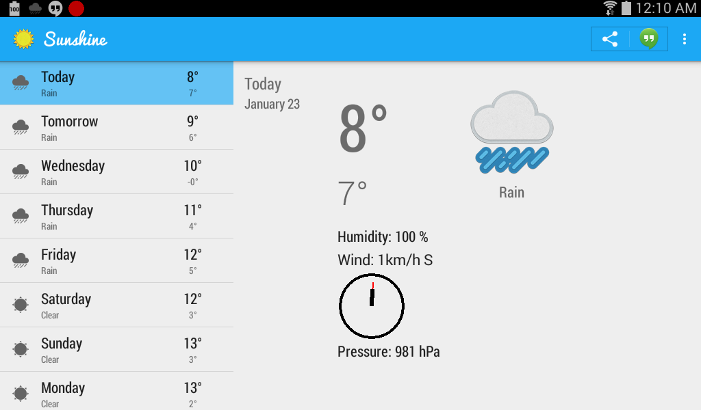

Sunshine
========

Sunshine is the companion Android app for the Udacity course [Developing Android Apps: Android Fundamentals](https://www.udacity.com/course/ud853).

Take the course to find out how to build this app a step at a time, and eventually create your own Android App!

This is the second version of the Sunshine code. The repository has been updated on:

* **February 13th, 2015** - Major update
* February 25, 2015 - Minor bug fixes
* March 4th, 2015 - Minor bug fixes

For the original version, please go [here](https://github.com/udacity/Sunshine).

A changelog for the course can be found [here](https://docs.google.com/a/knowlabs.com/document/d/193xJb_OpcNCqgquMhxPrMh05IEYFXQqt0S6-6YK8gBw/pub).

Sunshine provides user to see weather conditions. It displays a main screen showing weather infomation for several days. And clicking any one of them opens a detail page showing more detailed weather information for that day.

<figure>
<figcaption align="center">Tab Portrait</figcaption>
</figure>

<figure>
<figcaption align="center">Tab Landscape</figcaption>
</figure>
Adding API Key
==============

In order to use the application you first make an account on [Open Weather Map](https://openweathermap.org/api).Then signIn in the account and under the API keys tab you can find the key. Now go to the android project and add this key inside build.gradle for the app.
